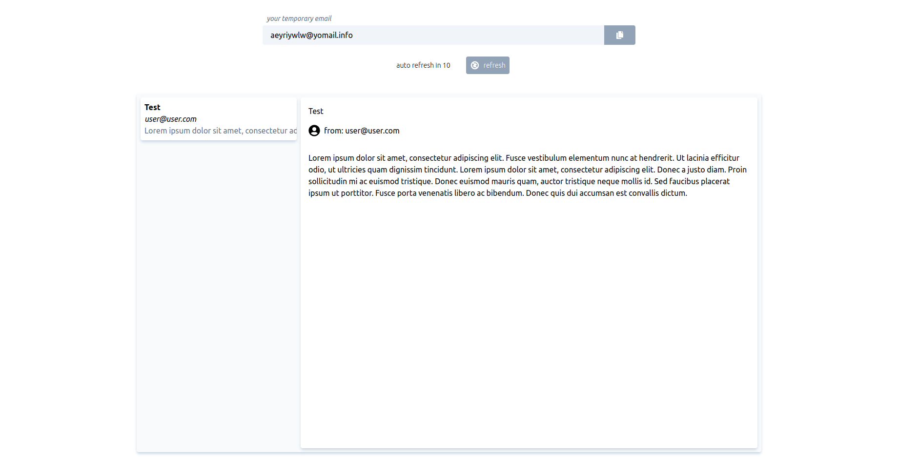

# Desafio DropMail.me

Esta é a minha solução para o Desafio DropMail.me, um projeto de front-end que envolve a construção de uma aplicação para consumir uma API de email temporário. O objetivo deste desafio é demonstrar minhas habilidades de desenvolvimento front-end e minha capacidade de trabalhar com as tecnologias sugeridas.

 

## Tecnologias Utilizadas
---

- Framework: React.js
- Framework CSS: Tailwind CSS
- Outras bibliotecas: Apollo Client, React Toastify, React Icons

 

## Processo de Criação do Projeto
---

Durante o processo de criação do projeto, foram seguidos alguns passos para atender aos principais objetivos e necessidades propostos no desafio. A história a seguir relata o desenvolvimento do projeto, desde o entendimento inicial até o deploy final.

- Leitura e Entendimento do Projeto:
Após receber o desafio, foi realizada uma leitura minuciosa dos requisitos e casos de uso apresentados. Isso incluiu a compreensão das funcionalidades esperadas, como gerar um endereço de e-mail temporário, copiar o endereço gerado e visualizar a caixa de entrada. Essa etapa foi essencial para definir a direção do desenvolvimento.

- Aprendizado das Tecnologias Propostas:
Como o desafio propôs a utilização de tecnologias como GraphQL, Apollo Client e Tailwind CSS, foi necessário dedicar um tempo ao aprendizado dessas tecnologias. Foram estudados tutoriais, documentações e exemplos de código para adquirir o conhecimento necessário para implementá-las adequadamente no projeto.

- Criação do MVP:
Inicialmente, foi criado um MVP (Minimum Viable Product) sem a execução das requisições necessárias para consumir a API. Nessa fase, foram desenvolvidos os componentes básicos da aplicação, como a interface de usuário, a estrutura de arquivos e a configuração inicial do projeto.

- Consumo de API e Compreensão dos Requisitos:
Após a criação do MVP, foi realizado o consumo da API do DropMail para atender aos requisitos propostos. Foi necessário compreender a estrutura das requisições.

- Revisão dos Componentes:
Com a funcionalidade básica implementada, foi realizada uma revisão dos componentes desenvolvidos. Foram feitas melhorias no código, ajustes de estilo e refatorações para garantir a qualidade e a usabilidade da aplicação.

- Criação de Testes:
Para garantir a qualidade e a estabilidade do código, foram desenvolvidos testes automatizados. Utilizando a biblioteca Vitest e a Testing Library.

- Containerização com Docker:
Visando facilitar o processo de implantação e garantir a portabilidade do projeto, foi realizada a containerização com o Docker. Foi criado um Dockerfile que define as dependências, comandos de construção e configurações necessárias para executar a aplicação em um ambiente Docker.

- Deploy com Vercel

 

## Descrição do Projeto
---

O Desafio DropMail.me tem como objetivo fornecer uma solução para gerar endereços de email temporários, permitindo que os usuários utilizem serviços sem expor seus endereços de email reais. A aplicação consome a API do DropMail e oferece as seguintes funcionalidades:

- Gerar um endereço de email temporário
- Copiar o endereço de email gerado para a área de transferência
- Visualizar a caixa de entrada do email gerado
- Verificar periodicamente novos emails a cada 15 segundos
- Receber notificações na área de trabalho para novos emails (com permissão do usuário)
- Salvar os dados de acesso ao email no armazenamento local para persistir a conta entre atualizações da página

 

## Ativação do CORS Anywhere
---

Para habilitar o CORS Anywhere e solicitar acesso temporário ao servidor de demonstração, siga estas etapas:

- Abra seu navegador e acesse https://cors-anywhere.herokuapp.com/corsdemo.
- Na página do CORS Anywhere, encontre o botão "Request temporary access to the demo server".
- Clique no botão "Request temporary access to the demo server".

Lembre-se de que o acesso temporário é concedido por um período limitado e está sujeito às políticas e restrições do CORS Anywhere. Certifique-se de usar o recurso de forma responsável e de acordo com os termos e condições do serviço.

 

## Como Começar
---

Para executar o projeto localmente, siga estas etapas:

1. Clone o repositório: `git clone https://github.com/mateussousaa/DropMailChallenge.git`
2. Navegue até o diretório do projeto: `cd DropMailChallenge`
3. Instale as dependências: `npm install`
4. Inicie o servidor de desenvolvimento: `npm start`
5. Abra o navegador e acesse `http://localhost:5173`

 

## Configuração do Docker Compose
---

Para facilitar o deploy e colaboração com a equipe de DevOps, o projeto foi configurado para funcionar com Docker Compose. Siga estas etapas para executar o projeto usando o Docker Compose:

1. Certifique-se de ter o Docker Compose instalado em sua máquina.
2. Clone o repositório: `git clone https://github.com/mateussousaa/DropMailChallenge.git`
3. Navegue até o diretório do projeto: `cd DropMailChallenge`
4. Execute o comando `docker-compose up -d`
5. O projeto estará sendo executado em `http://localhost:5173`

 

## Implantação
---

O projeto foi implantado na plataforma Vercel e está disponível em https://drop-mail-challenge-six.vercel.app/.

 

 

## Testes Unitários e Testes E2E
---

Para garantir a qualidade e confiabilidade do código, foram implementados testes unitários. As seguintes bibliotecas e frameworks foram utilizados para os testes:

- Testes Unitários: Vitest, React Testing Library e User Event

Para executar os testes, utilize os seguintes comandos:

- Executar testes unitários: `npm run test`

 

>  This is a challenge by [Coodesh](https://coodesh.com/)
